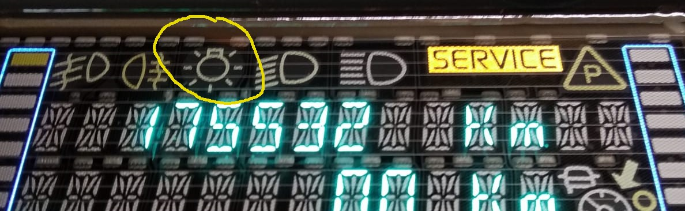

# A lowcost DIY CAN bus emulator for Renault Scenic 2 dashboard repair

This code is an adapted version of the original
[UNO+MCP515](https://github.com/dirksan28/Scenic2DashCanEmu) based project by
@dirksan28 for an ESP32 board with a CAN transceiver (e.g. SN65HVD230).

## Features
- build to test your Renault Scenic 2 dashboard after and during repair
- powers up your dashboard without the need of installation in the car
- large test sequence. Shows saved km/milage on startup. (see video)
- if connected to a serial console: timestamp and message logging on screen
- standalone operation (only with charging adapter) possible

\
[](https://vimeo.com/568058419 "CAN bus - Emulator in action - Click to watch on Vimeo!")

[click to watch the full vid on Vimeo](https://vimeo.com/568058419)


## What you need
- an ESP32 board (any ESP32 board should work, tested with a basic [esp32 dev kit](https://docs.espressif.com/projects/esp-idf/en/latest/esp32/hw-reference/esp32/get-started-devkitc.html) board)
- a CAN transceiver module (e.g. https://www.amazon.com/s?k=SN65HVD230 or https://www.aliexpress.com/wholesale?catId=0&SearchText=SN65HVD230+arduino) Make sure to choose one that have a 120Ω termination resistor.
- The platformio embedded developement framework (cli or IDE) https://platformio.org to compile and upload the sketch to the ESP32.

## Hardware

### Wireing
#### ESP32 <-> VP230
| PIN on ESP21 | PIN on VP230 CAN Bus Breakout Board  |
| ------------ | ------------ |
| D21 | CTX |
| D22 | CRX |
| 3V3 | 3V3 |
| GND | GND |

To work properly, make sure the CAN bus termination resistor is populated.

#### The dashboard
|PIN# (grey connector on dash)| meaning |
| --------------------------- | ------- |
| 1                           | +12V    |
| 2                           | GND     |
| 29                          | CAN LOW |
| 30                          | CAN HI  |

##### Hint
The dash takes about 4-5 amps peak current (filament heating, caps) when it starts up.
Especially when using small current limiting lab power supplies this may become a thing.
Make sure your power supply and cabling is sufficient.

## Software
The project can be compiled and uploaded via the platformio development tools. Either
clone this project or download it as a
[ZIP-File](https://github.com/douarda/Scenic2DashCanEmu/archive/refs/heads/esp32.zip).

```bash

(pio) david@shuttle:~/src/Scenic2DashCanEmu$ pio run -t upload
Processing esp32 (framework: arduino; platform: https://github.com/tasmota/platform-espressif32/releases/download/v2.0.2idf/platform-espressif32-2.0.2.zip; board: esp32dev)
-------------------------------------------------------------------------------------------------
Verbose mode can be enabled via `-v, --verbose` option
CONFIGURATION: https://docs.platformio.org/page/boards/espressif32/esp32dev.html
PLATFORM: Espressif 32 (2.0.2) > Espressif ESP32 Dev Module
HARDWARE: ESP32 240MHz, 320KB RAM, 4MB Flash
DEBUG: Current (esp-prog) External (esp-prog, iot-bus-jtag, jlink, minimodule, olimex-arm-usb-ocd, olimex-arm-usb-ocd-h, olimex-arm-usb-tiny-h, olimex-jtag-tiny, tumpa)
PACKAGES:
 - framework-arduinoespressif32 2.0.2
 - tool-esptoolpy 1.30200.211025 (3.2.0)
 - tool-mklittlefs 1.203.210628 (2.3)
 - tool-mkspiffs 2.230.0 (2.30)
 - toolchain-xtensa-esp32 8.4.0+2021r2
Converting canEmulator.ino
[...]
Wrote 184224 bytes (105875 compressed) at 0x00010000 in 2.8 seconds (effective 518.4 kbit/s)...
Hash of data verified.

Leaving...
Hard resetting via RTS pin...
================================== [SUCCESS] Took 8.03 seconds ==================================
```

The Message-Sequence can be extended or modified by patching the following code
fragments within the [canEmulator.ino](./src/canEmulator.ino "link to canEmu.ino") file:

### Code
```c
/**
 * the following stuct contains the messages which are send to the dash
 * for initialization
 * feel free to add or remove messages.
 * {duration, id, dlc {byte1, byte2, ... byte_dlc}}
**/
const struct msgStruct initMessages[] PROGMEM = {
   {10, 0x35d, 8, { 0x10, 0x03, 0x20, 0x00, 0x00, 0x00, 0x50, 0x00}}   //dash on
  ,{4, 0x60d, 8, { 0x00, 0x10, 0x00, 0x00, 0x27, 0x73, 0x21, 0x71}}    //reset displ state
...
};

/**
 * the following stuct contains the messages which are send to the dash
 * within a loop
 * feel free to add or remove messages.
 * {duration, id, dlc {byte1, byte2, ... byte_dlc}}
**/
const struct msgStruct messages[] PROGMEM = { //load into flash-memory (sram was to small)
  {1, 0x743, 8, {0x02, 0x10, 0xC0, 0x00, 0x00, 0x00, 0x00, 0x00}}  //enable indicators
  ,{3, 0x743, 8, {0x04, 0x30, 0x06, 0x20, 0xFF, 0x00, 0x00, 0x00}} //left ind. lights
  ,{3, 0x743, 8, {0x04, 0x30, 0x07, 0x20, 0xFF, 0x00, 0x00, 0x00}}
  ,{1, 0x743, 8, {0x04, 0x30, 0x01, 0x20, 0x01, 0x00, 0x00, 0x00}}
  ,{1, 0x743, 8, {0x04, 0x30, 0x01, 0x20, 0x07, 0x00, 0x00, 0x00}}
  ,{1, 0x743, 8, {0x04, 0x30, 0x01, 0x20, 0x06, 0x00, 0x00, 0x00}}
  ...
  };
```
To see what the code is doing. Start the serial console at 115200 Baud:

```bash

$ pio device monitor -b 115200
--- Available filters and text transformations: colorize, debug, default, direct, esp32_exception_decoder, hexlify, log2file, nocontrol, printable, send_on_enter, time
--- More details at https://bit.ly/pio-monitor-filters
--- Miniterm on /dev/ttyUSB0  115200,8,N,1 ---
--- Quit: Ctrl+C | Menu: Ctrl+T | Help: Ctrl+T followed by Ctrl+H ---
0:1:42	58	{2, 743, 8, {4, 30, 4, 20, BC, 0, 0, 0, }}
0:1:43	59	{7, 743, 8, {4, 30, 3, 11, 1, 0, 0, 0, }}
0:1:46	60	{15, 60D, 8, {0, 0, 0, 0, 63, 0, 21, 70, }}
0:1:54	0	{1, 743, 8, {2, 10, C0, 0, 0, 0, 0, 0, }}
0:1:54	1	{3, 743, 8, {4, 30, 6, 20, FF, 0, 0, 0, }}
0:1:56	2	{3, 743, 8, {4, 30, 7, 20, FF, 0, 0, 0, }}

```

## Current state
The code was tested on a V5.14 dashbord and runs fine.

## Design principles
- keep it stupid simple
- even "non-arduino experts" should be able to use and set up the project easily
- keep dependencies as few as possible (e.g. libraries, source files, additional hardware, ...)
- adaptable and expandable even without knowledge of C / C ++

## Collection of ideas
- Read the CAN messages from an external SD card (thus support for different dashboards without having to compile the code)
- single step mode (possibly forwards and backwards) via an additional button
- PCB layout for a self containing, single board solution

## Known issues
- CAN message to activate the lightbulb symbol is currently unknown  

## Further infos & links
- If you search for further information, **tips & tricks on how to rapair your Renault Scenic II dashboard** - take a look at https://www.digital-kaos.co.uk/forums/showthread.php/59335-repair-dashboard-scenic-2
- One of the most comprehensive dashboard repair video (unfortunately in french - but the subtitle function should do the trick) https://www.youtube.com/watch?v=UUcnZQbhVvc
